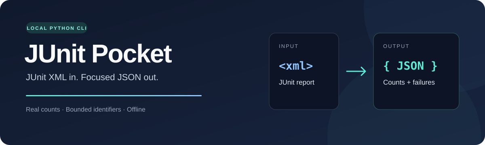
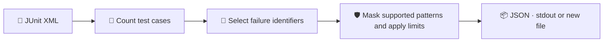

<p align="center">
  
</p>

<p align="center">
  <strong>A small, local CLI that turns JUnit XML into a focused JSON test summary.</strong><br>
  Real test counts. Bounded failure identifiers. No account or API key.
</p>

<p align="center">
  <a href="https://github.com/umutgungorr/junit-pocket/actions/workflows/ci.yml"></a>
  
  
  
</p>

<p align="center">
  <a href="#-quick-start">Quick start</a> ·
  <a href="#-see-the-output">Example output</a> ·
  <a href="#-cli-options">CLI options</a> ·
  <a href="#-data-boundaries">Data boundaries</a>
</p>

---

## ✨ Why JUnit Pocket?

You already have a JUnit report. You need its test totals and failing test names in a predictable format for a script, a CI step, or another tool.

| 🧮 Accurate counts | 📦 Compact output | 🏠 Local by default |
| :--- | :--- | :--- |
| Counts actual `testcase` records instead of trusting declared XML totals. | Includes failure/error identifiers with a configurable limit and a count of omitted entries. | Uses Python's standard library, with no runtime dependencies or network requests. |



## 🚀 Quick start

Requires **Python 3.12+**. Run these commands from the repository root using the included source code.

### Windows · PowerShell

```powershell
$env:PYTHONPATH = (Resolve-Path ./src).Path
python -m junit_pocket --junit examples/sample.xml
```

### Linux / macOS

```bash
PYTHONPATH=src python -m junit_pocket --junit examples/sample.xml
```

**Save a JSON file and limit the failure list:**

```powershell
# PowerShell, after setting PYTHONPATH above
python -m junit_pocket --junit examples/sample.xml --max-items 5 -o report.json
```

```bash
# Linux / macOS
PYTHONPATH=src python -m junit_pocket --junit examples/sample.xml --max-items 5 -o report.json
```

Replace `examples/sample.xml` with your own JUnit report. Without `-o`, JSON goes to stdout. An existing output file is never overwritten.

> 💡 A successful conversion exits with `0`, even when the report contains failing tests. Invalid arguments, input, or output produce exit code `2`.

## 📊 See the output

The included sample has **4 tests**: one passed, one failed, one error, and one skipped.

| ✅ Passed | ❌ Failed | ⚠️ Errors | ⏭️ Skipped |
| :---: | :---: | :---: | :---: |
| 1 | 1 | 1 | 1 |

```json
{
  "schema_version": "1.0",
  "summary": {
    "tests": 4,
    "passed": 1,
    "failed": 1,
    "errors": 1,
    "skipped": 1
  },
  "failures": [
    {"kind": "failure", "name": "test_checkout", "classname": "tests.shop"},
    {"kind": "error", "name": "test_connection", "classname": "tests.db"}
  ],
  "omitted_failures": 0,
  "notice": "Best effort masking; identifiers may still contain sensitive data."
}
```

### How the counts work

- Counts come from actual `testcase` records. If a record has several status elements, precedence is **error → failure → skipped → passed**.
- XML namespaces, nested suites, and UTF-8 BOM are supported.
- A valid empty suite produces zero counts. A report declaring a positive test count without test records is rejected.
- `omitted_failures` counts failure/error entries excluded by the list limit. Totals still cover all test records.

## 🧰 CLI options

| Option | What it does | Default |
| :--- | :--- | :--- |
| `--junit FILE` | Read a JUnit XML report. | Required |
| `-o FILE`, `--output FILE` | Write JSON to a new file; refuse overwrite. | stdout |
| `--max-items N` | Include up to `N` failure/error identifiers, from **1 to 100**. | `20` |
| `--help` | Show command help. | — |

Each `name` and `classname` is limited to **160 characters**, after supported patterns are masked. The JSON format is versioned with `schema_version: "1.0"`.

## 🛡️ Data boundaries

| Area | Behavior |
| :--- | :--- |
| Input | A regular UTF-8 or UTF-8 BOM file, at most **1 MiB**. |
| Validation | Rejects input symlinks, DOCTYPE/ENTITY declarations, unsupported roots, and malformed XML. |
| Output | Test totals and failure/error identifiers; excludes message bodies, stack traces, file-path attributes, and captured stdout/stderr. |
| Masking | Replaces supported `API_KEY=...`, `Bearer ...`, and `ghp_...` patterns in identifier fields with `[REDACTED]`, before clipping. |
| Execution | Parses an existing report without running the reported tests or making network requests. Leaves the input file unchanged. |

> 🔎 Masking is **best effort**, not complete anonymization. Other sensitive values can remain in test names or class names. Review the JSON before sharing it.

This version converts JUnit XML to JSON. It does not parse Ruff reports, produce Markdown reports, or diagnose the cause of test failures.

## 🧪 Validation & development

GitHub Actions runs **Ruff, the shipped product and CLI contract tests, and a sample CLI conversion** on each push and pull request.

The delivered code also passed the factory's five Docker stages: syntax, lint, protected CLI contract, behavior/regression tests, and CLI smoke. That validation used a sandbox with networking disabled and a non-root user.

With **pytest installed** in your development environment:

```powershell
# Windows / PowerShell
$env:PYTHONPATH = (Resolve-Path ./src).Path
python -m pytest -q tests contract_tests
```

```bash
# Linux / macOS
PYTHONPATH=src python -m pytest -q tests contract_tests
```

Source-mode usage is validated. A PyPI release and wheel installation have not been validated for this delivery.

## 🏭 Built with Daily PR Factory

<details>
<summary><strong>Production record & current maturity</strong></summary>

The initial draft was generated by Daily PR Factory with **one Gemini call** and failed some behavioral checks. **Codex completed and corrected the implementation locally**, documented it, and validated it again in Docker, with **zero additional Gemini calls**.

This is an assisted completion, not a fully autonomous Gemini success. Market demand and differentiation from competing tools have not yet been validated.

</details>

---

📚 Format reference: [pytest JUnit XML output](https://docs.pytest.org/en/stable/how-to/output.html).
